<h1 align="center">  Hi there, I'm Pouya </h1>

<h2 align="center">✦ Love to Design & Develop Software Products ✦</h2> 

 

Building smart UIs & digital experiences that matter, from Mobile Apps to UX-driven Frontend Web Development. I design and build digital products with a strong focus on user experience, scalability, with clean design. Currently exploring <b> React, Next.js & TailwindCSS </b> to bring my product ideas to life.
   
 
<h3 align="center">🛠️ Languages and Tools:</h3> 

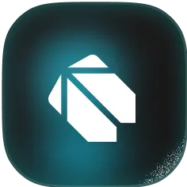
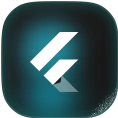
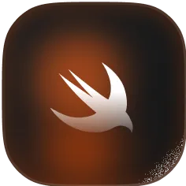
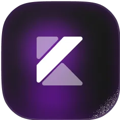

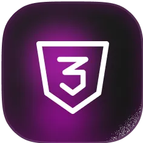
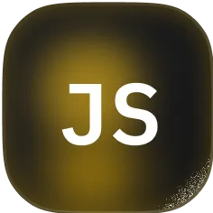
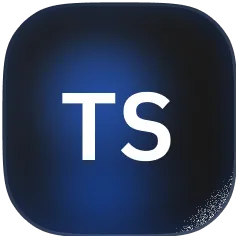
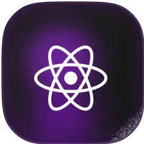
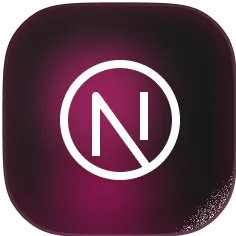
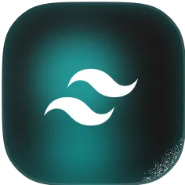
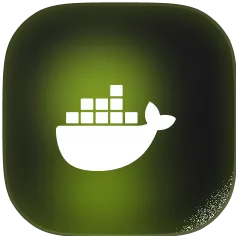

<!-- tech icons designed by myself -->
<!-- Full icon set on my Figma Account: @pouyamaroufi -->
